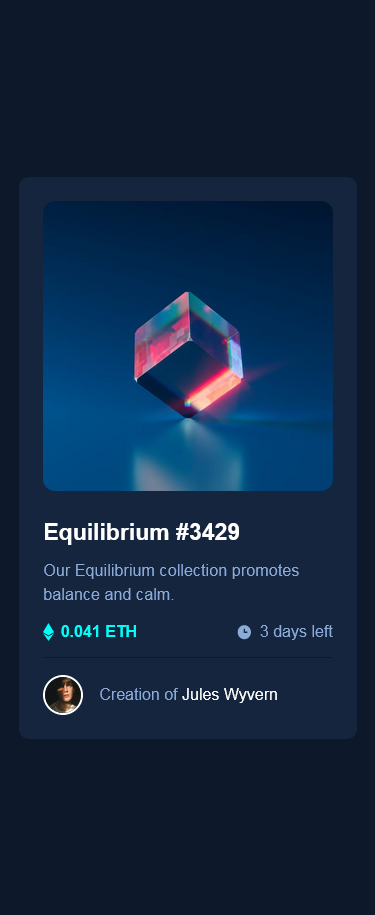
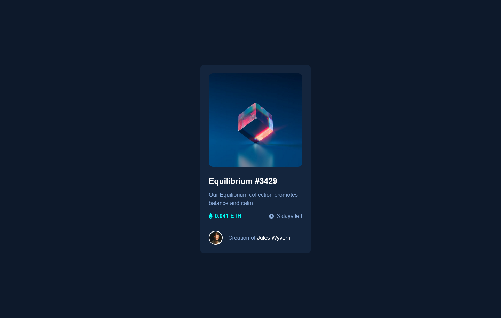

# Frontend Mentor - NFT preview card component solution

This is a solution to the [NFT preview card component challenge on Frontend Mentor](https://www.frontendmentor.io/challenges/nft-preview-card-component-SbdUL_w0U). Frontend Mentor challenges help you improve your coding skills by building realistic projects.

## Table of contents

- [Overview](#overview)
  - [The challenge](#the-challenge)
  - [Screenshot](#screenshot)
  - [Links](#links)
- [My process](#my-process)
  - [Built with](#built-with)
  - [What I learned](#what-i-learned)
  - [Useful resources](#useful-resources)
- [Author](#author)

## Overview

### The challenge

Users should be able to:

- View the optimal layout depending on their device's screen size
- See hover states for interactive elements

### Screenshot

### Links

- Solution URL: [github](https://github.com/kushyzee/NFT-preview-card-component)
- Live Site URL: [github pages](https://kushyzee.github.io/NFT-preview-card-component/)

## My process

### Built with

- Semantic HTML5 markup
- CSS custom properties
- Flexbox
- Mobile-first workflow

### What I learned

I had a tough time figuring out how to overlay the cyan color over the equilibrum.jpeg image and I also had to add the icon-view.svg image on the overlayed cyan color which had to show up when a mouse hovers over it, but luckily i learnt how to do it from w3schools website

### Useful resources

- [W3schools](https://www.w3schools.com/howto/howto_css_image_overlay_icon.asp) - They have been a tremendous help in helping me figure out how to overlay an icon over an image

## Author

- Frontend Mentor - [@kushyzee](https://www.frontendmentor.io/profile/kushyzee)
- Twitter - [@yourusername](https://www.twitter.com/kushyzeena)
